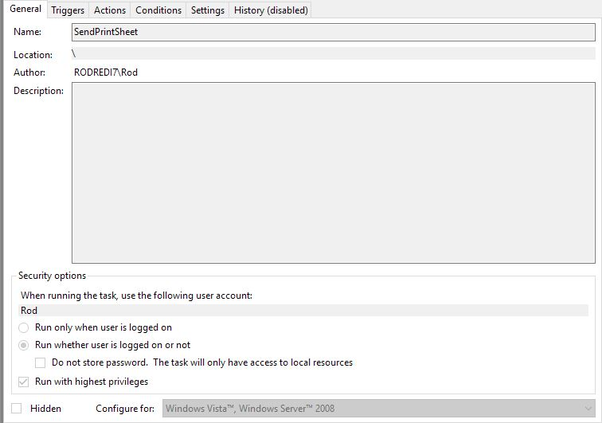
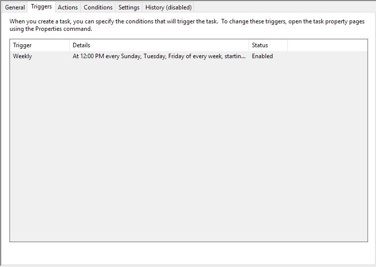
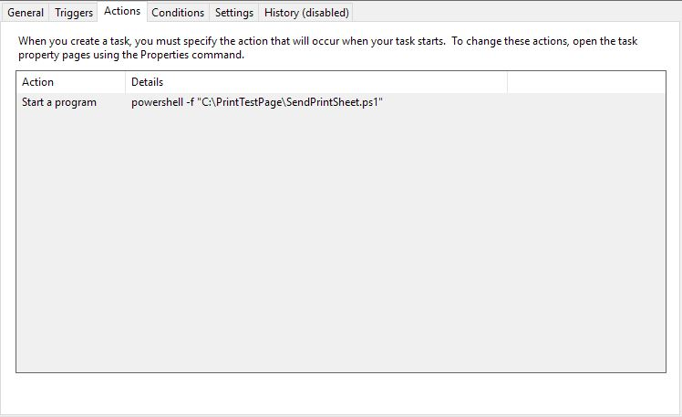

**Powershell Script and Function** for use in sending a color test print page to 
the default printer... primarily for the purposes of keeping ink jet nozzels 
unclogged.

**Why?**

I got tired of prematurely retiring more than a couple printers due to their Ink Jet nozzels
getting clogged after a while of use.

Credit to the creator of the .ps1 and .psm1 file code, which came from here:
http://monadblog.blogspot.com/2006/02/msh-print-image.html

The simple PrintColorTestPage.jpg is a 8.5*11 color image using with yellow, magenta, blue and black 
to try to have some of all colors.

**How to Set it up**
1. Creat a directory to clone the project files into it, I'm using *C:\PrintTestPage*
2. Setup a Task in TaskScheduler to run the powershell scripts. Screenshots of the properties of the task are here:

Found that once a week isn't enough to ensure print heads/nozzels don't get clogged
so I've scheduled this task to run 3 times a week. 

